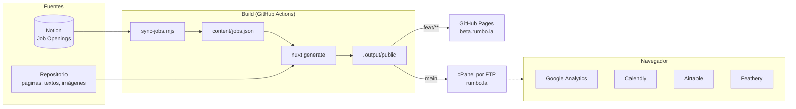
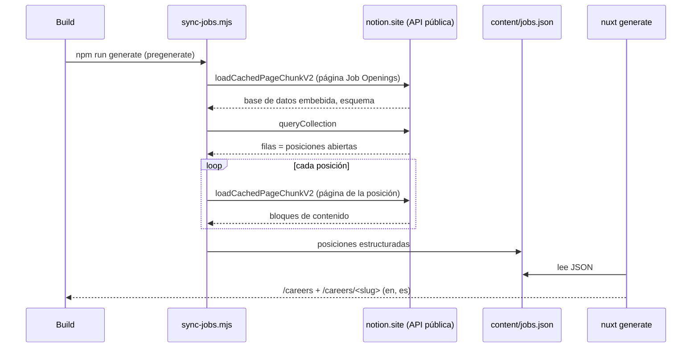

# Arquitectura

Cómo está construido el sitio de Rumbo y por qué. Para el día a día (comandos, dónde editar), ver el [README](../README.md).

## Visión general

El sitio es **100 % estático**. Todo el HTML se genera en el build y se sirve como archivos: no hay servidor de aplicación, base de datos ni API propia en producción. Lo dinámico (formularios, analítica, agenda) vive en servicios externos.

**Por qué estático:** el contenido cambia poco, el hosting de producción es un cPanel compartido (solo archivos) y así no hay nada que mantener ni atacar en el servidor. El costo es que cualquier cambio de contenido, incluido Notion, necesita un build.

## Aplicación (Nuxt 4)

| Aspecto | Decisión |
| --- | --- |
| Renderizado | `ssr: true` + `nitro.preset: 'static'`: cada ruta se prerenderiza a HTML y luego Vue hidrata en el navegador. |
| Código | Estructura de Nuxt 4 en `app/`. Componentes, composables y utilidades auto-importados. |
| Estado | Sin store global. Estado compartido con `useState` en composables (`useJoin`, `useContact`); preferencias en `localStorage` (cookies). |
| Estilos | Tailwind 3 + SCSS con scope (`@apply`). Tema en `tailwind/`. Ver [design system](design-system.md). |
| Calidad | ESLint 9 (`@nuxt/eslint`), Prettier y `vue-tsc` (`typeCheck: true`). |

### Rutas

| Ruta | Página | Notas |
| --- | --- | --- |
| `/` | `pages/index.vue` | Home |
| `/staffing`, `/recruiting` | servicios | |
| `/why-rumbo`, `/community` | propuesta de valor y comunidad de talento | |
| `/careers` | `pages/careers/index.vue` | Listado de posiciones con buscador y filtros (en cliente). |
| `/careers/<slug>` | `pages/careers/[slug].vue` | Una página por posición de Notion. |
| `/t-c` | términos y condiciones | |

Cada ruta existe sin prefijo (inglés), con `/en/` y con `/es/`.

## Internacionalización

- `@nuxtjs/i18n` con `strategy: 'prefix_and_default'` e inglés como idioma por defecto.
- Mensajes en `i18n/locales/{en,es}.json`. Algunas claves llevan HTML y se renderizan con `v-html` (la regla `vue/no-v-html` está desactivada a propósito; el contenido es propio).
- `detectBrowserLanguage` redirige la raíz según el idioma del navegador y lo recuerda en la cookie `i18n_redirected`.
- Los enlaces internos usan `NuxtLinkLocale` para conservar el idioma.

## SEO

- `usePageSeo('CLAVE')` fija título, descripción, keywords, Open Graph y Twitter por idioma desde `app/constants/meta.ts`.
- `app.vue` agrega `lang`, canonical y alternates `hreflang` con `useLocaleHead`.
- Canonical y sitemap apuntan siempre a `https://rumbo.la`, también en beta, para que Google no indexe beta como contenido duplicado.
- `@nuxtjs/sitemap` genera `sitemap_index.xml`; las rutas de posiciones se agregan desde `nuxt.config.ts`.
- Cada posición publica datos estructurados `JobPosting` (Google for Jobs).

## Oportunidades: sincronización con Notion

Transformación de cada posición:

| Entrada en Notion | Salida en `jobs.json` |
| --- | --- |
| Propiedades Name, Practice, Area of Expertise, Seniority, Modality, Location, Created | `title`, `practices`, `areas`, `seniority`, `workModes`, `location`, `published` |
| Líneas `Modalidad:`, `Tipo de contrato:`, `Vacantes:`, `Nivel:`, `Reporte:` | `facts` (cabecera y tarjeta de postulación) |
| Secciones por título ("Responsabilidades", "Requisitos", …) | `sections.about`, `responsibilities`, `requirements`, `nice`, `others` |
| Lista de "Qué ofrecemos" | `offer` (un bloque por beneficio) |
| Sección "Tu impacto", o el beneficio que empieza con "La oportunidad de…" | `sections.impact` |
| Herramientas mencionadas en el texto (lista fija de ~60) | `technologies` |
| "sector seguros", "sector financiero", … | `sector` |
| Link de Airtable | `applyUrl` |
| Página completa | `html` (búsqueda y datos estructurados) |

Decisiones:

- **API pública, no oficial.** No necesita token ni integración, pero Notion puede cambiarla. Por eso el script valida la forma de los datos y **falla** si falta algo o no hay posiciones: el deploy se detiene y queda publicada la versión anterior.
- **HTML escapado.** El texto de Notion se escapa antes de convertirlo en HTML; los enlaces solo aceptan `http(s)`. Quien edita Notion no puede inyectar scripts en el sitio.
- **Archivo generado, no versionado.** `content/jobs.json` está en `.gitignore`. `useJobs` lo carga con `import.meta.glob` para que lint y typecheck funcionen aunque no exista.
- **Actualización por horario.** Como el sitio es estático, los cambios de Notion llegan con el siguiente build: merge a `main` o los horarios programados del deploy de producción.

## CI/CD

| Workflow | Disparador | Hace |
| --- | --- | --- |
| `build.yml` | Reutilizable (`workflow_call`) | `npm ci`, lint, typecheck, `generate` (incluye sync de Notion) y sube `.output/public` como artefacto `site`. |
| `ci.yml` | Pull requests | Ejecuta `build.yml`. |
| `deploy-beta.yml` | Push a `feat/**`, manual | `build.yml` → GitHub Pages (environment `github-pages`). Cancela despliegues anteriores en curso. |
| `deploy-production.yml` | Push a `main`, horarios, manual | `build.yml` → FTP a cPanel (environment `production`). Nunca cancela un despliegue en curso. |

Los horarios (`cron`) se escriben en UTC; Lima es UTC−5. GitHub puede retrasar o descartar ejecuciones programadas en el minuto 0 de cada hora.

## Seguridad

| Medida | Dónde |
| --- | --- |
| Acciones de GitHub fijadas por SHA (versión en comentario) | `.github/workflows/*.yml` |
| `persist-credentials: false` en el checkout | `build.yml` |
| Permisos mínimos por workflow y por job | `permissions:` |
| Environments restringidos por rama (`feat/**` → beta, `main` → producción) | Configuración del repo |
| Contraseña FTP como secreto; FTPS por defecto | `deploy-production.yml` |
| HTTPS forzado, archivos ocultos bloqueados, cabeceras `X-Content-Type-Options`, `X-Frame-Options`, `Referrer-Policy`, `Permissions-Policy` | `public/.htaccess` |
| Google Analytics con consentimiento `denied` por defecto | `app/app.vue`, `CookieConsent.vue` |

Herramientas de verificación: `npm audit`, `actionlint`, `zizmor` (auditoría de workflows) y Dependabot sobre `main`.

## Deuda técnica conocida

- Modales de contacto y de unión sin usar (`Contact*`, `JoinUs*`) con un endpoint de Apps Script público.
- Escala tipográfica definida en `tailwind/font.js` pero no conectada al tema.
- Varios colores escritos a mano en lugar de tokens (ver [design system](design-system.md#deuda)).
- La sincronización depende de la API pública de Notion; si se vuelve inestable, migrar a la API oficial con un token como secreto.
